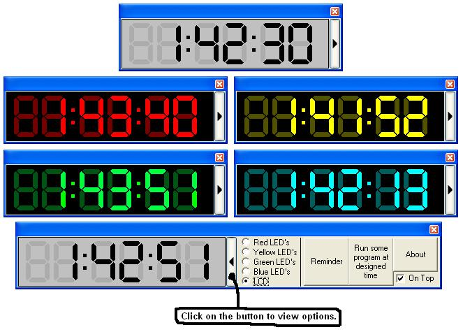



## Electronic Clock 1\.1

### Description

It's a cool electronic clock with 5 different styles (Red LED's, Yellow LED's, Green LED's, Blue LED's and cool LCD style (All graphics created by me)). It has a Reminder and automatic 1 program run at designed time. It can stay On Top. Sorry, but there is no comments :( Please vote and add feedbacks!
 
### More Info
 

             |
---                |---
**Submitted On**   |2005-06-13 14:56:22
**By**             |[Edgars Priede](https://github.com/Planet-Source-Code/PSCIndex/blob/master/ByAuthor/edgars-priede.md)
**Level**          |Advanced
**User Rating**    |5.0 (20 globes from 4 users)
**Compatibility**  |VB 5\.0, VB 6\.0
**Category**       |[Complete Applications](https://github.com/Planet-Source-Code/PSCIndex/blob/master/ByCategory/complete-applications__1-27.md)
**World**          |[Visual Basic](https://github.com/Planet-Source-Code/PSCIndex/blob/master/ByWorld/visual-basic.md)
**Archive File**   |[Electronic1901076132005\.zip](https://github.com/Planet-Source-Code/edgars-priede-electronic-clock-1-1__1-61113/archive/master.zip)

